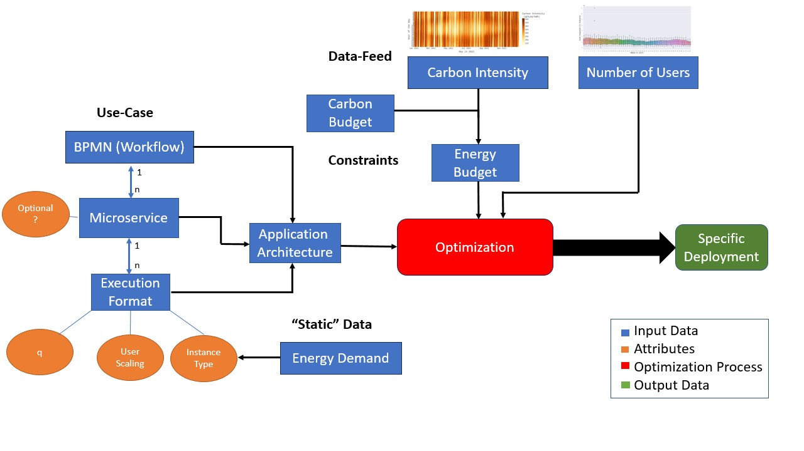

# Reducing the Carbon Footprint of Microservice-Based Cloud Applications by Periodically Scaling their Energy Demand

# Library of functions
The [lib.py](lib.py) file contains all the functions that are needed for the experiments.

# Experiments
There are in total 8 different experiments that were conducted:
1. Selective Optimisation
2. Carbon-Unaware (static) Baselines
3. Mathematical Optimum Solution
4. Simple carbon-aware approach
5. Randomized Energy Budget (Validation Approach)
6. Uniform Recycle Budget 
7. Weighted Recycle Budget
8. Hourly Recycle Budget

The results of the experiments can be found in the form of CSV files in the [results folder](results).

# Data visualisation 
The [dataViz folder](dataViz) contains the Jupyter Notebook used to create the visualisations of the results.  
The images that were created with the notebook can be found in the [img folder](img).

# Data 

## Data Sources
The data used for the experiments can be found in the [data folder](data).  
It consists of the following data sets:
- Carbon Intensity Data from [Electricity Maps](https://www.electricitymaps.com/data-portal) for Germany
  - [2020](/data/DE_2020.csv)
  - [2021](/data/DE_2021.csv)
- User-Request Data from [Wikipedia](https://dumps.wikimedia.org/other/pagecounts-raw/)
  - [2014](data/projectcount_wikiDE_2014.csv)
  - [2015](data/projectcount_wikiDE_2015.csv)

The carbon intensity data is licensed under [ODbl](https://opendatacommons.org/licenses/odbl/).

## Application Data
The data for the application architecture of the flight booking use case is stored in a [JSON file](flightBooking.json).  
Additionally there is an [XML-Parser](xml_parser/bpmnToJSON.py) that can parse BPMN-models in the form of XML files to JSON files.  
The BPMN XML file could for example have been derived from a BMPN modeller, such as [bpmn.io](https://bpmn.io/).  
The derived JSON file can then be enriched with the needed parameters for selectibe optimisation algorithm.